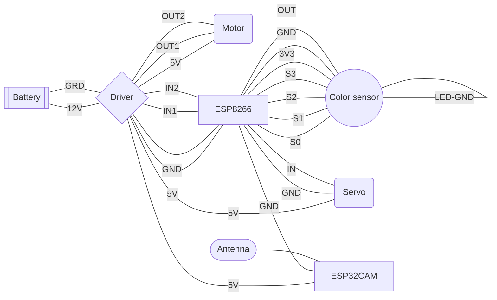
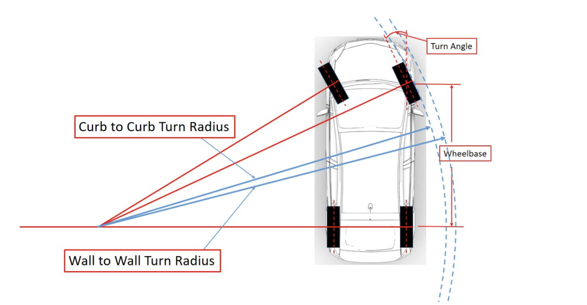
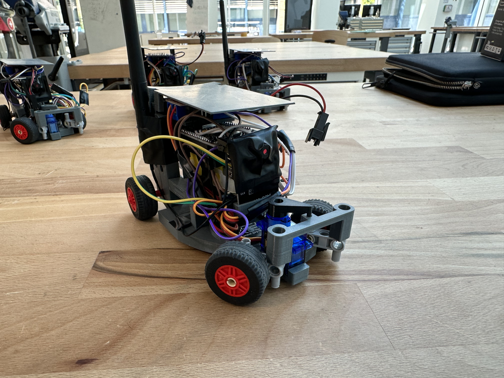
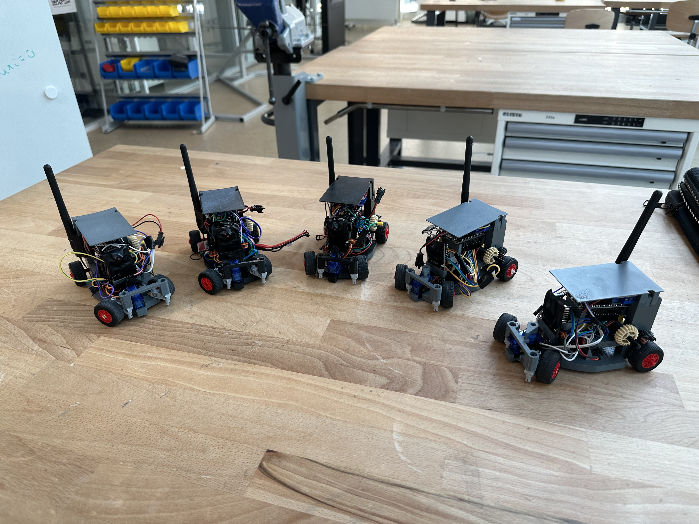
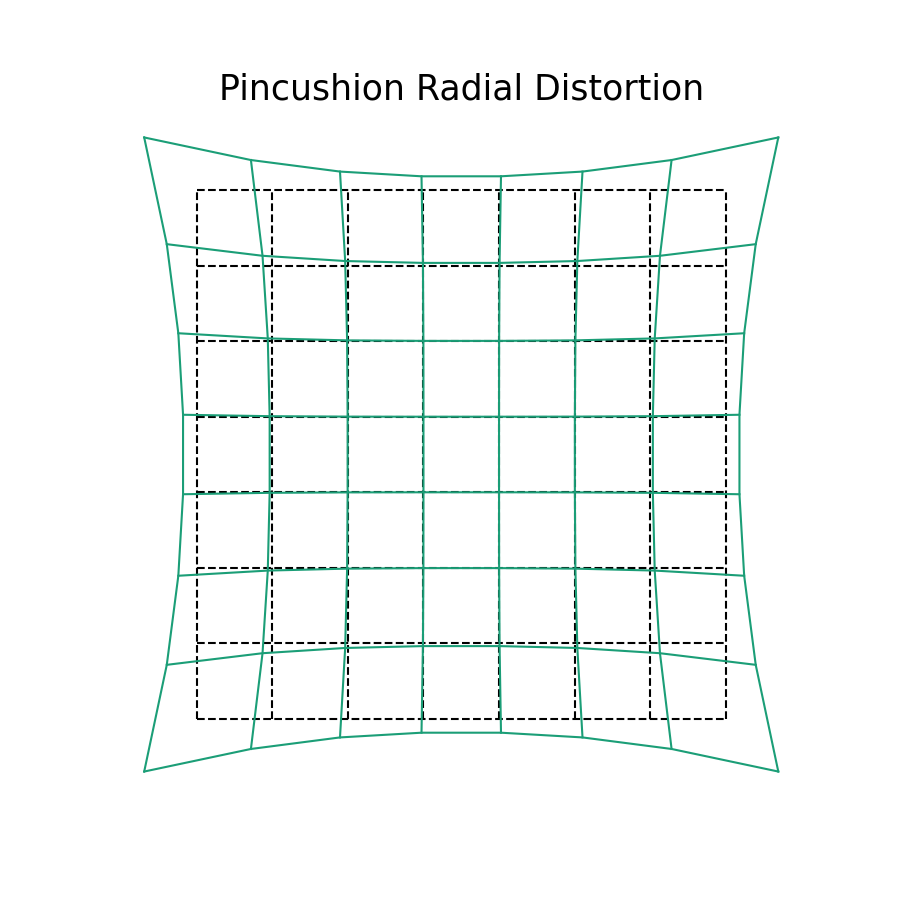
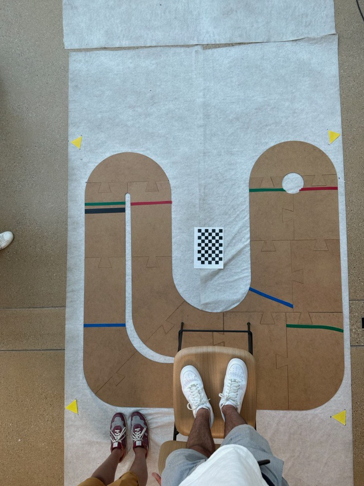
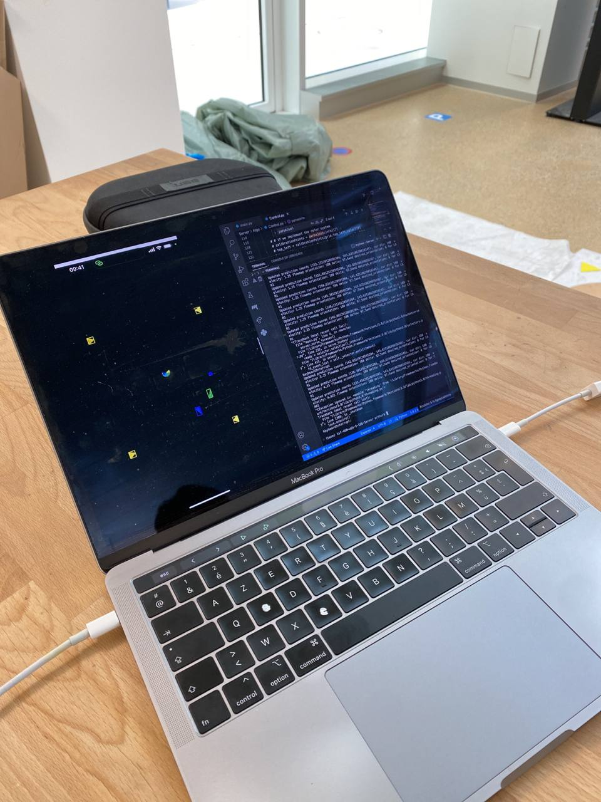
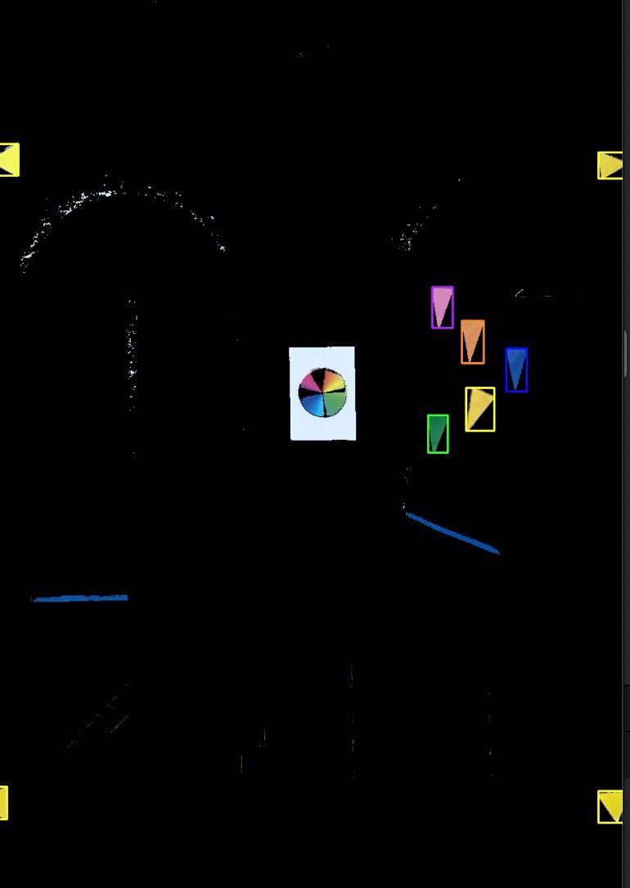
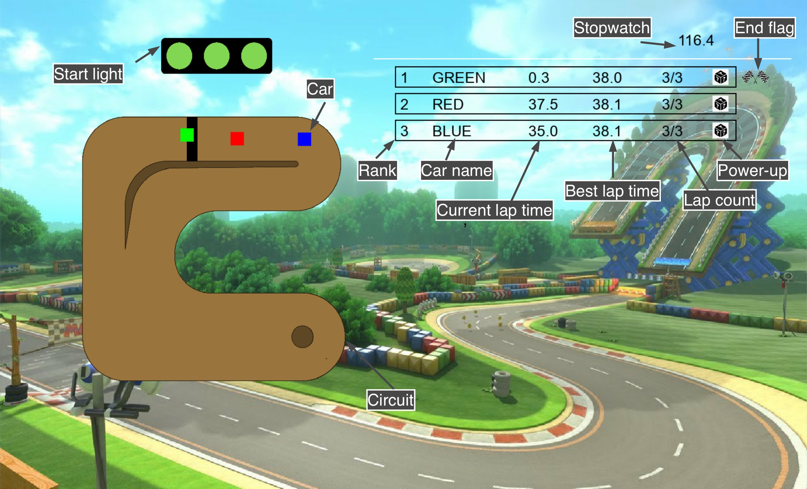

# MIT - Mario Kart

## Intro
In this project, we planned on creating our own adapted version of Mario Kart in real life. 
The goal was to create a circuit on which we would have 6 small remote-controlled cars, each car controlled either by an AI or by a player. 
We had imagined a few powerups that cars could collect, that would either affect the car collecting it or the other cars. 
There are three main parts to this project: an overhead camera that extracts simple shapes and colours from an image in order to be able to track each car’s position, 
the track and cars themselves, and lastly the main server controlling each individual car.  
You can find our initial project proposal [here](MIT_Team_Proposal.pdf).

## Cars

### Electrical Components

One challenge was making the cars small enough so that we can have multiple ones driving on the same circuit while still having a fast and precise drive. For that, we decided to use basic but effective electronic components. The list of the components used for each car is as follows:

>- [ESP8266 board](https://www.conrad.ch/fr/p/carte-de-developpement-sbc-nodemcu-esp8266-1613301.html)
>- [ESP32-CAM board](https://www.conrad.ch/fr/p/joy-it-sbc-esp32-cam-module-camera-1-pc-s-2332111.html?gclid=EAIaIQobChMIupPEp_an_wIVFwSLCh3cpACiEAQYBCABEgKRkvD_BwE&utm_source=google-shopping-fr&utm_medium=search&utm_campaign=shopping-online-fr&utm_content=shopping-ad_cpc&WT.srch=1&ef_id=EAIaIQobChMIupPEp_an_wIVFwSLCh3cpACiEAQYBCABEgKRkvD_BwE%3AG%3As)
>- [L298N motor driver](https://www.conrad.ch/fr/p/joy-it-motormodul-2-u-4-phasen-6-bis-12v-carte-de-developpement-1573541.html?utm_source=google-shopping-fr&utm_medium=search&utm_campaign=shopping-online-fr&utm_content=shopping-ad_cpc&WT.srch=1&ef_id=EAIaIQobChMIhq2tifen_wIVz_dRCh251QydEAQYASABEgK3X_D_BwE%3AG%3As&gclid=EAIaIQobChMIhq2tifen_wIVz_dRCh251QydEAQYASABEgK3X_D_BwE)
>- External antenna [(connector](https://www.digitec.ch/fr/s1/product/delock-cable-dantenne-sma-mhf-4-20cm-pour-linstallation-cable-dantenne-cable-dantenne-13123653?dbq=1&gclid=EAIaIQobChMIw-aUuPan_wIV1Pl3Ch0ynAiqEAQYBSABEgKyePD_BwE&gclsrc=aw.ds) & [antenna)](https://www.play-zone.ch/en/wlan-wifi-antenne-2-4ghz-mit-knickgelenk-sma-male.html?gad=1&gclid=EAIaIQobChMIw-aUuPan_wIV1Pl3Ch0ynAiqEAQYAyABEgJRwvD_BwE&___from_store=de)
>- [Motor](https://www.conrad.ch/fr/p/joy-it-com-motor01-moto-reducteur-jaune-noir-adapte-pour-ordinateur-monocarte-arduino-banana-pi-cubieboard-raspber-1573543.html)
>- [Servo](https://www.conrad.ch/fr/p/reely-mini-servomoteur-analogique-materiau-entrainement-plastique-systeme-de-connecteur-jr-2148502.html?gclid=EAIaIQobChMI8rjYpbj3_QIVkeR3Ch2lFAX7EAQYASABEgKR8_D_BwE&utm_source=google-shopping-fr&utm_medium=search&utm_campaign=shopping-online-fr&utm_content=shopping-ad_cpc&WT.srch=1&ef_id=EAIaIQobChMI8rjYpbj3_QIVkeR3Ch2lFAX7EAQYASABEgKR8_D_BwE%3AG%3As)
>- [Color sensor](https://www.conrad.ch/de/p/joy-it-sen-color-arduino-erweiterungs-platine-schwarz-passend-fuer-einplatinen-computer-arduino-1-st-1503748.html?gclid=EAIaIQobChMIocb197v3_QIVl7PVCh0icgzwEAQYASABEgIbVfD_BwE&utm_source=google-shopping-de&utm_medium=search&utm_campaign=shopping-online-de&utm_content=shopping-ad_cpc&WT.srch=1&ef_id=EAIaIQobChMIocb197v3_QIVl7PVCh0icgzwEAQYASABEgIbVfD_BwE%3AG%3As)
>- [7.4V Lipo battery](https://www.conrad.ch/fr/p/pack-de-batterie-lipo-7-4-v-1000-mah-conrad-energy-1344143-25-c-softcase-fiche-bec-femelle-1344143.html)

The ESP8266 board was used to connect every other component and to make a connection to the server used to control the cars while the ESP32-CAM board was used to stream the point of view of each car on a dedicated server.

### Connections and circuitry 

The electrical components were connected as follows:



### Color sensor calibration

The color sensor being sensible to the lightning conditions and its distance to its target, it needed to be calibrated to be as precise as possible. The code of the calibration is available on the repo.

A dedicated server was made at the beginning of testing and showed the performace of the sensor as seen below.


https://github.com/albertfares/MIT/assets/91048303/5f766e19-ce79-4871-9765-ed46f7992c80

### 3D-design
We have designed our cars using the software [Fusion 360](https://www.autodesk.fr/products/fusion-360/overview?term=1-YEAR&tab=subscription). The cars are composed of electronics, 3d printed parts and LEGO pieces. The first step was to import all the components into Fusion 360. For the electronic components, we have downloaded some existing models from the library [Crabcad](https://grabcad.com/library), listed below:

>- [ESP8266 board](https://grabcad.com/library/esp32-dev-kit-v1-1)
>- [ESP32-CAM board](https://grabcad.com/library/esp32-cam-1/details?folder_id=6305310)
>- [L298N motor driver](https://grabcad.com/library/l298n-17)
>- [Motor](https://grabcad.com/library/yellow-dc-motor-1)
>- [Servo](https://grabcad.com/library/sg90-micro-servomotor-1)

The color sensor and the battery are the only component for which we did not found a existing model. So we have precisely measured it and we have model it ourself.

We then imported the LEGO pieces. A good way of doing this is to use [BrinkLink Studio 2.0](https://www.bricklink.com/v3/studio/download.page). It's free, easy-to-use and it gives you access to a 3d model of all LEGO pieces. It also lets you assemble parts to build LEGOs directly within the application, but here we're only interested in the 3d model of the parts. Once we have selected the part we want in brinklink, we can't export it directly to Fusion 360. Here's how to do it:

>- In BrinkLing Studio 2.0, select File > Export As > "Collada" (.dae)
>- Use an online converter to convert your file from .dae to .stl. Here is a link to a converter: [Link](https://imagetostl.com/convert/file/dae/to/stl)
>- Import the file into Fusion 360
>- Rescale your lego part to a factor of exactly 0.04

Once all the parts have been imported. We were able to start designing the car. Design is a long and sometimes complicated process. The right solution doesn't come out on the first try, and sometimes you have to try again and again to get it right. There are a number of factors to take into account. In our case, we wanted the car to turn quickly. Which implies to have a small turning radius. One way of calculating it (approximately) is to measure the wheelbase (Wb), the steer angle (Sa) and the wheel width (Ww). The wheelbase is the distant beetween the front wheels and the rear wheels. The steering angle is the maximum angle at which the wheels can turn. 



[Image source](https://www.theautopian.com/the-engineering-behind-why-some-cars-can-turn-tighter-than-others/)

Once the measurements have been taken, we can calculate our turning radius (Tr) using this formula:   $Tr = \frac{Wb}{\sin(Sa)} + \frac{Ww}{2}$ 

Our car has a turning radius of 165.5 mm.

Here's a link if you want to know more about turning radius: [Link](https://en.wikipedia.org/wiki/Turning_radius)

Another important factor when building a car is the gearbox. Having a gearbox is essential and very useful for a car. When our engine runs, it runs at a certain speed and with a certain torque. In a nutshell Engine torque is the force of your motor's rotational movement. The more torque the engine has, the harder it is to stop. A gearbox is composed of gears, in our case LEGO gears, and is useful to turn the wheels using the motor. With a gearbox, we can do a reduction. A reduction implies that the wheels will rotate at a different speed than the motor. Reducing speed increases torque. And on the opposite, increasing speed reduces torque. If there isn't enough torque, the car won't move. So you need to find the right balance between the two. In our case we wanted the wheel to turn faster than the motor. This can be done by using a large gear on the motor followed by a smaller one. We used this [website](https://evolventdesign.com/pages/gear-ratio-calculator) to calculate the reduction. For our car, we have a 2.0833 gear ratio.

Taking these factors into account, we designed our car. Here's a timelapse of all the design process:

[Video Link](https://drive.google.com/file/d/1rE5q6M1Bsel_EN98zFcnqaiaQ2I-tCT6/view?usp=share_link)

Once the car has been designed, all that's left to do is print out the parts and build the car. 

To print the pieces, we used a Prusa printer (Original Prusa i3 MK3S & MK3S+) with a PETG filament. To use these printers, you need the [PrusaSlicer software](https://www.prusa3d.com/fr/page/prusaslicer_424/). Here are the steps to follow to print a part:

>- Select you part in Fusion 360 and click on "3d printing". Fusion 360 will then export an STL file.
>- Import the STL file into PrusaSlicer.
>- Click on "cut now". It will export a gcode file. 
>- Select the gcode file on your printer.

Of course there are a number of things to be careful about when printing. It's important to get the right settings. In our case, we used the default settings with a quality of 0.15 mm. It is also important to add support if necessary. When you need to print with support, you then have to remove it, which sometimes results in lower-quality parts. So we have designated our pieces to have to put on as little support as possible. We have divided our printing into 2 sets. The first set (Set_1_S) takes 4h42 and 39.18 g of filaments. The second set (Set_2_S) takes 4h13 and 37.89 g of filaments. Therefore a car takes a total of 8h55 and 77.07 g of filaments.

Here is a short animation showing how to assemble the car:

[Video Link](https://drive.google.com/file/d/1SugGETj4QmX7_Ma__iNNMzapm10kMvRc/view?usp=share_link)

Here are some photos:





Here is a video of the car driving:

[Video Link](https://drive.google.com/file/d/1jisL-YeDmEC7GNVOm17FnNlMF6QsF6Wv/view?usp=share_link)

For more details about the 3d model of the car, you can download the file LEGO - car.f3z from the repository.


## Circuit

### Design

The design of the circuit was made using Fusion360.
The main design of the circuit is shown below.


We then chose to laser cut the circuit on 3mm MDF boards, so we had to make a puzzle like design for both cutting and easier transportation and storage. The full .dxf file is included in the repo.

The laser cutting used aprox. 3 1.6x2m boards.

The final circuit looked like this:


## Phone Holder

### MDF structure

To hold the iPhone used to track the cars 3 meters above the ground, we had to be creative and make a phone holder that was attached to the railing of the DLL's first floor. The structure was laser-cut on 1cm MDF boards and was designed on FUSION 360 (.dxf design file available on the repo).
To make the phone holder strong and reliable, a puzzle-like design was used between pieces and the connections were strenghened by wood glue.


### 3D printed holder

To hold the iPhone in place, a custom designed holder was 3D printed and mounted on the MDF structure. 
The .f3d file available on the repo was made for an iPhone 14 Pro Max.


## iOS Application for Cars Detection


We needed a robust, latency-free car detection and coordinate system to feed the server to complete this project. We decided to go with what we had on hand, and use one of our phones to do the job. So we developed an iOS application in Swift and C++ (because we had to bridge OpenCV in C++, as a Swift version didn't exist).

Our first approach was to use machine learning to recognize the cars, but we quickly abandoned this idea as it was complicated to set up a model that corresponded to our cars, and the results were not very convincing.

So we turned to OpenCV, an open source computer vision library, for this task. As the library offers efficient tools for keeping only a particular range of colors and detecting shapes, it was perfect for our case.


### Reliable Coordinate System

The first challenge was to establish a reliable and precise coordinate system, which initially stymied us because we hadn't taken into account the radial distortion created by the phone's lens. Tangential distortion can occur when a camera lens is not perfectly aligned or when the camera sensor is not parallel to the subject but that's not the case here as the phone was placed to be perfectly parallel to the circuit.

<br>
<p align="center">
  
  <br>
  Illustration of theorical radial lens distorsion
</p>

Fortunately, OpenCV makes it easy to correct this distortion, and the hardest part was calibrating the camera and finding its distortion coefficients. For those curious about this, the [OpenCV Calibration](https://docs.opencv.org/4.x/dc/dbb/tutorial_py_calibration.html) page is very well documented.

<p align="center">
  
  <br>
  Image illustrating the effects of lens distortion at a height of 2.50 m above the circuit where the phone was fixed. The circuit forms a rectangle, but you don't get this impression when you look at the photo because of the distortion. 
</p>

### Calibrating the circuit

Once we had a reliable coordinate system with lens distorsion corrected, the next step was to calibrate our circuit properly. 

When launched, the application launchs in calibration mode. To calibrate the circuit properly, we chose to place a triangle in each corner of the circuit (yellow equal-sided triangle here). The coordinates of these 4 triangles are sent to the server so that it can match the coordinates in the flow map with the coordinates sent by the application.

Here's the technical process for detecting yellow triangles: 
- Request a new image from the iPhone camera.
- Transform it into the OpenCV image format (Mat format) and un-distort it (correct for lens distortion).
- Apply a yellow filter to retain only the yellow elements of the image.
- Perform shape detection on the image and keep only the triangles.
- Obtain the center of each triangle in the iOS coordinate system.
  
If we detect exactly 4 triangles and the positions have been the same for 5 seconds, we send these positions to the server.

Once the server has confirmed that it has received the positions, the application switches to car detection mode. The application also retains the points it used to calibrate, so that any potential false positives outside the rectangle formed by the calibration points are filtered out and not sent to the server.

<p align="center">
  
  <br>
  Each of the yellow triangles is placed in one of the corners of the rectangle formed by the circuit. They are used for calibrating the coordinate system.
</p>


### Detecting cars and their orientation

Now that the server is calibrated and we have our coordinate system, we just need to detect the cars and their orientation.

We therefore decided to equip each car with an isosceles triangle of a very distinct color. The isosceles triangle because a triangle is one of the least common shapes in a commonplace environment, and isosceles to detect the orientation of the car. The orientation detection works as follows: we detect the triangle, then its smallest side, we then draw a perpendicular to the center of its smallest side, which allows us to find the car's orientation in degrees using basic math.

Here's the technical process for detecting cars and their orientation:
- Request a new image from the iPhone camera.
- Transform it into the OpenCV image format (Mat format) and un-distort it (correct for lens distortion).
- For each car's color:
  - Apply a color filter to retain only the elements of the car's color in the image.
  - Perform shape detection on the image and keep only the triangles.
  - Obtain the coordinates of the intersection of the two longest sides of the isocele triangle, which we'll use as the car's coordinate. 
  - Identify the smallest side and draw a perpendicular to its center to obtain the orientation of the car (0-360 degrees).
- Send to the server the position of each car and its orientation.

<p align="center">
  
  <br>
  Screenshot of the application in cars detection mode. Each car is detected by the application and indicated on the screen by a rectangle of the corresponding color. The information is sent to the server.
</p>

### Performance

In terms of performance, the application was able to recalculate car positions and orientations and send them to the server 10 to 15 times per second.

### Potential Drawback

One drawback is that to avoid false positives, the color calibration had to be very precise, and is only accurate for a certain time slot (depending on the amount of sunlight entering the building where we calibrated it). As a result, there were occasional false positives on certain colors, particularly in the evening when there was no sun. This can of course be adjusted by recalibrating.

## AI Algorithm
### Overview
The main goal of this project is having cars controlled by players and cars running by themselves (AI controlled cars). In order for the autonomous cars to do a complete lap, they have to follow predetermined directions i.e a flowmap.
#### Flowmap
A flowmap is a map of desired orientation across the circuit, which we separated into a 40x40 grid. For greater clarity in the code, we chose to represent these orientation as hours on a watch (h3 => 0 deg, h12 => 90 deg, h6 => 270 deg, etc...). At each step the car's orientation (the attribute Car.orientation) is compared to its desired one indicated by the flowmap and a change of direction is applied accordingly.

We then calculate the desired steering angle to send to the Arduino which lies between 0 and 180, 90 meaning going straight.


#### Acceleration

Having cars following orientations is great, but in practice the cars take time to turn and their orientation doesn't change immediately. We needed the cars to slow down when approaching sharp bends.

We designed a zone system where each zone has a maximum speed allowed. These zones are bounded with coloured tape on the circuit. There are 3 types of them (ordered in decreasing speed): Green, Blue and Red.

In the Arduino code, the "currZone" variable is either green for full speed, blue for normal speed or red for low speed. Then the variable "speed_percentage", which is determined by the zones, is either 1.25, 1.00 or 0.75.
When a car drives over some tape, its colour sensor detects it and the above-mentioned variables are updated. 
There is also an "out" zone which corresponds to speed_percentage = 0.00 and white colour for the white tarp below the circuit. When a car steps out of the road, it must be placed back on the circuit to continue.

At each step the server sends the variable "rcvd_acc" to the Arduino. We then multiply this value by speed_percentage and give this value to the analogWrite method for the motor. If rcvd_acc is negative we apply it to the PIN_REVERSE instead of the PIN_FORWARD.

#### Powerups

In addition to the red, green and blue tape, we put brown tape on the circuit for powerups. When the sensor detects it, the variable "isPowerupd" is set to 1 and sent to the server. When the server receives it, a random powerup generator is started.

Powerups can have positive or negative effects : 
The first one is to increase your speed by changing Car.acc, the second one is to slow down every other cars and the last one is to invert the commands of all players (not AI) by changing Car.inverted.
The circuit was too narrow so we couldn't implement the last one.

Each powerup lasts 5 seconds as shown below : 
```python
    if self.isOnPowerUp(car):
        if car.startTime == -1:
            pu.powerUp(car, self.cars)

    if car.startTime != -1 and (datetime.datetime.now() - car.startTime).seconds >= POWERUP_TIME:
        car.startTime = -1
        car.acc = pu.NORMAL
        print("STOP POWERUP")
```          

With POWERUP_TIME = 5.

Note: since there were times when testing where the color sensors weren't fully calibrated or times where they produced false positives, we added on the server the same logic described above for powerups and acceleration to use if we wanted to disregard the input from the color sensor. However, in the final version of the project we didn't need to do so but still we left this code commented out (so you could see what how we used it).

##### Overtake

With the powerups and the zone system, cars can have different speed across the map. We didn't want them to bump each other (at least not the AI ones) so we had to implement an overtake system.

At first we thought about delimiting a semi-circle behing each cars. When another car drivees into this area, it starts changing its orientation (car.delta) to overtake. This change is proportional to the distance between the two cars. If they are really close, the overtake needs to be more brutal than if they were far away.

But we had problems with Matplotlib (which we used for the semi circles) and the circuit was too narrow to overtake smoothly. So we implemented an slowdown method which calculates a rectangle behind each car and forces the other cars to slow down (changes car.acc) when they are in it.


### AI Simulation
#### Update Movement
Update movement is a method that we used in order to test the flowmap in a simulation. We made it possible to simulate the way a car would (in theory) follow the flowmap in the GUI. This method wasn't used in the final server, but it proved to be very useful in calibrating a first version of the flowmap. The "orientation" around the flowmap uses the classic trig circle: 0 degrees points to the right of the circuit, 90 degrees to the top, 180 to the left and 270 to the bottom.
The way the method works is very simple - it takes a desired velocity and angle as parameters, and computes the next speed, acceleration and coordinates the car would have and stores them in the car's corresponding attributes. 
At first the car's orientation is updated. If the desired angle is negative, this means that the car should turn right (think of it as a negative angle difference on the trig circle, so clockwise), otherwise it should turn left. If the absolute angle difference between the desired angle and the current angle is smaller than ANGLE_PRECISION (an aribitrarily defined constant, to be tweaked as you see fit), then the car won't turn. Whenever it turns, it does so by ANGLE_UNIT every time the method is called.
Next, the method checks which is the desired velocity and updates the car's acceleration and velocity accordingly using basic kinematic equations, implemented in a very naive way. Technically, the way it's coded you can simulate the car's acceleration changing over time, but we tweaked the constants to give it an almost constant acceleration because we didn't need the added precision (if ACC_UNIT = MAX_ACC, then you will get a constant acceleration). Next, the car's speed gets updated according to its acceleration. Both the acceleration and speed are upper bounded (respectively MAX_ACC and MAX_VELOCITY).
Finally, the car's coordinates get updated according to the car's speed, previous position and current orientation. Keep in mind, this method will never be 100% precise, but it works well enough with the constants calibrated to the right values.

## Server 
### Overview
Everything in this project was connected to our main server. It controlled the AI driven cars and processed the input from the remote controllers and sent it to the player cars. It also took input from the camera to know where the cars were on the circuit which was then displayed on the GUI and used for the AI algorithm displayed above.

We used the ThreadedTCPServer library to open a thread for each new connection and then defined a method that was used to handle all newly received information and send back the information needed by the cars or the camera.

The Control class is used to process the information sent to the server and is responsible for figure out the information to send back to each connection.

### Camera connection 
The server receives from the camera, the position and orientation of each cars. Each car object on the server has a `color` attribute, which corresponds to the color of the triangle on top of the car which is detected by the camera. 
#### ID system
The server recognises that the input is from the camera because the camera precedes all its messages by an id "CAM". The same technique is used by the cars to identify themselves: each car has a specific id. This makes it so that the only IP address necessary to know is the server's (the camera and cars need to know where to connect to). The server will then reply to connections from the camera and cars but we don't need to input their IP in the server before hand.
#### Updating the cars based on the information from the camera
The server then stores the coordinates of each car and its orientation and calls `moveCar` which will look at the flowmap to find the desired orientation of the car, calculate the delta sent to the car (angle that needs to be applied by the servo) based on that information and will figure out the acceleration that needs to be sent to the car based on the zone it currently is in (if we are not using the color sensor).
#### Grid system
Since the coordinates sent by the camera are originally within 1080x1920, we need to translate to the actual coordinates in real life. To do so, we use the coordinates of the 4 yellow triangles sent by the camera when it is in calibration mode and use this info to establish a grid. Then, for all future coordinates sent by the camera, we use this grid to translate them to real life positions. Once the server is calibrated, it connects back to the camera to tell it to exit calibration mode.

### Car Connection
Each car connects to the server with a car id. The server uses this id to get its corresponding car object on the server and sends back to the car, the correct information. Either the orientation and acceleration found using the algorithm if it's an AI driven car or the information processed using the controllers for player cars.
#### Server connection
The ESP8266 boards each connect to the main server over wifi, which must all be connected to the same wifi. For this we used the personal hotspot of the phone acting as the camera, which proved a little unreliable as it sometimes decided to become undiscoverable on its own. We often had to resort to yelling "hey Siri, open hotspot settings" while standing on a chair in order to be closer to the phone. 
Once the boards were connected to wifi, we had them connect to the server using WifiClient from the ESP8266WiFi.h library. The boards would send colour sensor information in the form of an integer between 0 and 5, indicating what kind of checkpoint the car has passed (while it isn't passing a checkpoint, it perpetually sends a 0):
0 = circuit, 1 = powerup, 2 = red tape, 3 = green tape, 4 = blue tape, 5 = car is off the circuit
The boards then received all movement data straight from the server, in the form of 2 integers. The first received integer indicated the value to be weitten to the car's servo (between 0 and 180, inclusive). The second indicated the car's speed: a negative integer meant that the car should drive backwards, a positive integer meant that the car should drive forwards and 0 meant stop. 
To separate these two integers from the received string, we used strtok() to separate the string and atoi() to convert the numbers in the string to the int type.
Two important elements we overlooked that probably greatly contributed to server-board latency were the heat produced by the motor on the car (which probably greatly slowed the board down) and the interference caused by other electronic devices in the near vicinity. There were never that many people around us before the demo day, but when people started arriving the day of the demo, the cars connected to the personal hotspot but never to the server.

#### Joystick
We faced more challenges than we had anticipated for the joystick controlling the car. First, we tried using Blynk, except that we couldn't get the Arduino to connect to Blynk's servers and to our server both at once, and we still don't know why. 
Next, we tried reusing and adapting the code one of us had written to control the cars we each made for the personal project (different cars to this project). It worked by hosting a webserver directly on the Arduino using the ESP8266WebServer.h library and then connecting to that webserver using a phone (with the Arduino connected to that phone's personal hotspot). The joystick worked perfectly while not connected to the server, but had terrible latency issues when connected to the server at the same time as hosting the webserver.
In an attempt to fix this, we tried using the car's second board (the ESP32-Cam-AI-Thinker). The idea was to have the ESP8266 host the webserver and have the ESP32 communicate with the main server, and then transmit any data received from the main server over the two boards' Serial ports, using the RX/TX pins and the SoftwareSerial.h library. Unfortunately, we again ran into high latency issues. Anyone who wants to use the SoftwareSerial.h library should know that it takes a lot of processing power and therefore slows the board down. In theory, it's possible to communicate over Serial without using this library, but by this point we were running out of time. Serial communication is painful and long to debug, because you can't send messages to another board over Serial and print received messages to the console at the same time, so you need to be a little creative (to test it out, we connected both boards to a dummy server that just prints messages and had each board transmit any received from the other board). Therefore, we were forced to downgrade to a system where powerups could only affect one car at a time until we came up with our final solution: console controllers connecting to the computer hosting the main server, and the main server sending on the movement data the the ESP8266.

This final solution was implemented using pygame because it already had a way of detecting a controller once it has been connected to the computer using bluetooth (Note that this module supports xbox one and 
pro Switch controllers perfectly, but for reasons unknown we were unable to get ps4 controllers to work). So what we ended up assigning to our car object a controller from the Controller class if a JOYDEVICEADDED event from pygame was added and if the car was a player driven car. Then we updated each car object constantly by looking at the joystick position to figure out the angle to send to the car and if the forward or backwards button were pressed, to figure out what acceleration to send the car. As described above, the same arduino code was used for player and AI cars so we send that information to the cars in the same way as we did for the AI car. This lets us decide for a given round what cars will be AI or player driven without reuploading arduino code, this is done by simply changing the `ai` attribute of the car when initialising the car object.

[Video controller_1](https://drive.google.com/file/d/1reOZbyJa6JoQu1c-rn_mInbwud_DtXWd/view?usp=sharing)

[Video controller_2](https://drive.google.com/file/d/1dASTlvPD5uQj2d0VwFhFrCf5u4_w9qwt/view?usp=sharing)

## GUI

To make our project more complete, but also more fun to play, we decided to add a GUI (Graphical User Interface). Since
our server was already coded in python, using pygame seemed to be the best solution. 
### Interface
The interface is fairly simplistic. 


On the left, there is a map of the circuit. On this map, a colored square indicates the position of each car, and a color 
is associated with each car. Above the circuit is the start light. It is red at the first, and turns green when the race begins.

On the right, there's a classification. In the upper right-hand corner is a timer. The timer starts when the race begins. 
Below this is the ranking for each player. The number on the left corresponds to the player's position. Then the player's name. 
To the right of this is the player's lap time. This is a measure of the time it takes the player to complete a turn. This 
time resets to 0 each time the starting line is crossed, provided all checkpoints have been passed.  Then there's the player's 
best lap time. On the right is a lap counter. This shows the player the number of laps remaining. A lap is added each time 
the player crosses the start line and has passed all checkpoints. Next, the power-up is displayed. Each time the player has
a power-up, it is diplayed here with an image associated with each power-up. Finally, when the player has finished the race. 
That is, when he has completed the correct number of laps, a small flag is displayed, showing that the player has finished.



Here is a video showing the GUI with a game (without power_up):

[Video Link](https://drive.google.com/file/d/1Wopnna9PGnGgz63frg08rsFXboGv2CES/view?usp=sharing)

### Streaming server

To stream each car's pov, we used an esp32 cam on each car which streams continually on a custom server. The code used to enable the streaming on the boards allows to chose the quality and format of the video output. We personally went with the SVGA format and a quality of 63 (to have a fluid stream). All the videos are then combined on a streaming server which can handle up to 6 cars' povs. The code for the server and the html design are both on the repo.

It looked like this:


## Final takeaway

[Video Link](https://drive.google.com/file/d/1U7BNgFku9bf5cgFWT6QTgowsCUX8AMdn/view?usp=share_link)


On avait qq choses qui marchait correctement avec 3/4 voitures en conditions normales malgré un AI encore quelque peu imprécis.
Malhheuresement, le jour de la démonstration on a été pris de cours par des soucis de communciations (intéférences) qui ont fait qu'il a été impossible de démontrer que notre projet était fonctionnel ce jour là. Néanmoins vous trouverez attaché une vidéo montrant le projet fonctionnel.
Nous nous n'avions malheuresement pas anticipé ces problemes de latence du aux intérférences/soucis de communication qui ont été excacerbés le jour de la démonstration du à la grand concentration de personnes. 

C'est surement le point qui nous a le plus ralenti car il a été dans un premier temps difficile à identifier, puis à régler, (limite pas réglable avec ce genre de board, probleme deja rencontré par d'autres groupes les années précédentes, freeze de board).

Un autre point que l'on a sous estimé est la mise en commun des différents composants qui marchaient individuellement les uns les autres.
